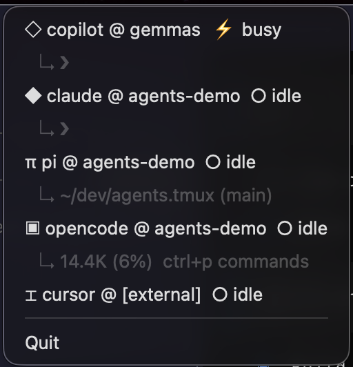

# agents.tmux

Tmux agent status indicator with pluggable presentation frontends. Today it ships with a macOS menu bar frontend and a Waybar frontend, both powered by the same tmux agent discovery core.



## The idea

When you run multiple AI agents in parallel you constantly alt-tab to check if anyone needs your input. This app puts a single glyph in your menu bar that tells you at a glance:

The counts **accumulate across every tmux server you have** — every local socket *and* any host you're SSH'd into — so one badge reflects all your agents whether they're on this machine or on a remote dev box. See [Remote agents over SSH](#remote-agents-over-ssh).

| Badge | Meaning |
|-------|---------|
| `🟢 2` | 2 agents busy — you're free, go do something else |
| `🟡 1` | 1 agent waiting for you, others still running — start wrapping up |
| `🔴 2` | all 2 agents waiting on you — act now |
| `🔴 3` | all 3 agents idle/done, none working — act now |
| `◌` | no agents found |

Click the badge to see a per-agent status line and jump straight to its tmux window — your terminal is auto-detected and raised — or plug the same status snapshot into another desktop surface like Waybar.

## Requirements

- Python 3.11+
- tmux
- A presentation frontend:
  - **macOS menu bar**: macOS. Click-to-focus raises your terminal, auto-detected from those running (Ghostty, iTerm2, Terminal, WezTerm, kitty, Alacritty, Warp, Hyper, Tabby); pin `terminal_app` in config if you run more than one.
  - **Waybar**: Linux/Wayland + Waybar
- For [remote agents over SSH](#remote-agents-over-ssh) (optional): Python 3.11+ and tmux on the remote, plus key-based SSH access

## Install

```bash
git clone https://github.com/yourname/agents.tmux ~/dev/agents.tmux
cd ~/dev/agents.tmux
pip3 install -r requirements.txt
```

To verify detection without any frontend:

```bash
python3 tmux_agents.py
```

### macOS menu bar

```bash
bash run.sh
```

### Waybar

The Waybar frontend prints a single JSON snapshot suitable for `return-type = "json"`:

```bash
python3 app.py --frontend waybar
```

Or, if you prefer the existing launcher script:

```bash
bash run.sh --frontend waybar
```

```
Session: auto  |  Poll: 2s  |  Agents: ['claude', 'copilot', 'pi', 'cursor', 'opencode', 'codex']

⚡ ◇ copilot  @ gemmas          [busy   ]  Esc to cancel
⚡ ◆ claude   @ feature-branch  [busy   ]  ✻ Editing…
○ ◆ claude   @ main             [idle   ]  ❯
○ π pi       @ notes            [idle   ]  ~/dev/notes (main)
○ ▣ opencode @ agents-demo      [idle   ]  14.4K (6%)  ctrl+p commands
○ ◈ codex    @ codex-worktree   [idle   ]  /model gpt-5-codex
○ ⌶ cursor   @ [external]       [idle   ]
```

Agents running outside tmux (in their own terminal window) are detected via `ps` and shown with `[external]` as the window name.

## Remote agents over SSH

agents.tmux counts agents on remote machines too, and folds them into the same badge. Remote agents are labeled with their host (e.g. `π pi @ devbox:main`) and clicking one switches that host's tmux to the agent's window over SSH.

**Zero-install on the remote.** Nothing is deployed or kept running there. Each poll, the discovery script is piped to the remote's `python3` over SSH (`ssh host python3 - --emit-json`), which runs the *identical* detection logic and returns its agents as JSON. The remote only needs:

- Python 3.11+
- tmux
- key-based SSH access (so it never prompts for a password)

**How hosts are found.** By default agents.tmux scans your local process list for live `ssh <host>` sessions and pulls from each — so any box you're actively connected to appears automatically. You can also pin hosts that should always be counted (even with no live session) via `remote_hosts`.

```toml
# Remote hosts (SSH) — see Configuration for all keys
auto_discover_remote = true    # find hosts from live `ssh <host>` sessions
remote_hosts = []              # always-pull pinned hosts, e.g. ["devbox"]
ignore_hosts = []              # skip these, e.g. ["github.com"]
remote_poll_interval = 6       # poll remotes less often than local panes
```

**Traffic and safety.** Connections are multiplexed (`ControlMaster`/`ControlPersist`), so the first pull opens one SSH connection per host and every later poll reuses it — no re-handshake. A pull ships ~25 KB and returns a few hundred bytes, once per `remote_poll_interval`. `BatchMode` means a host needing a password fails fast instead of hanging, and a failed host is skipped (negative-cached) for `remote_error_cooldown` seconds. Only read-only commands run remotely (`tmux list-panes`, `tmux capture-pane`, `ps`). Use `ignore_hosts`/`allow_hosts` to keep it away from servers you don't want polled.

## Frontend architecture

`tmux_agents.py` remains the discovery/detection layer. Presentation frontends consume a shared indicator snapshot from `indicator.py`, which means new targets can be added without reimplementing the status rules.

Current frontends:

- `macos` — launches the existing `rumps` menu bar app
- `waybar` — prints one-line JSON with `text`, `alt`, `tooltip`, and CSS `class` values

That shared snapshot is the seam for future integrations like SketchyBar or other desktop indicators.

## Waybar integration

Add a custom module that executes the Waybar frontend:

```jsonc
"custom/agents-tmux": {
  "return-type": "json",
  "exec": "python3 /home/your-user/dev/agents.tmux/app.py --frontend waybar",
  "interval": 2,
  "escape": true
}
```

Then place `"custom/agents-tmux"` in one of your `modules-left`, `modules-center`, or `modules-right` arrays.

The module emits these CSS classes so you can style states independently. The badge
emoji already encodes the color; match it in CSS for the bar text:

- `empty` — no agents
- `busy` — green: agents working, you're free
- `mixed` — yellow: some waiting on you, others still working
- `waiting` — red: all waiting on you, act now
- `idle` — red: all idle/done, nothing working, act now

Example CSS:

```css
/* yellow: some need you, some still working */
#custom-agents-tmux.mixed {
  color: #f9e2af;
}

/* red: nothing is progressing — go now */
#custom-agents-tmux.waiting,
#custom-agents-tmux.idle {
  color: #f38ba8;
}

/* green: working, you're free */
#custom-agents-tmux.busy {
  color: #a6e3a1;
}
```

## Run on login

On macOS, add `run.sh` as a Login Item in **System Settings → General → Login Items**.

## Auto-start with tmux

Alternatively, start the macOS menu bar app lazily whenever you attach to tmux. Add to `~/.tmux.conf`:

```tmux
set-hook -g client-attached 'run-shell "pgrep -f agents.tmux/app.py >/dev/null || (nohup ~/dev/agents.tmux/run.sh >/tmp/agents.tmux.log 2>&1 &)"'
```

Reload with `tmux source-file ~/.tmux.conf`. The hook checks if `app.py` is already running and launches it in the background if not — so it's a no-op on subsequent attaches. Logs go to `/tmp/agents.tmux.log`.

## Configuration

`config.toml` lives next to `app.py`, or at `~/.config/agents.tmux/config.toml` for a user-level install. These detection settings are shared by every frontend.

```toml
session = "auto"      # or a specific session name, e.g. "main"
poll_interval = 2     # seconds

# ── Local sockets ──────────────────────────────────────────────────────────
# Agents are summed across EVERY live tmux server (socket) on this machine,
# not just the default one. Empty ignore list = count every live socket.
ignore_sockets = []            # e.g. ["mytest*"] to skip throwaway fixtures
# allow_sockets = ["default"]  # opt-in allowlist instead (omit = allow all)

# ── Remote hosts (SSH) ─────────────────────────────────────────────────────
auto_discover_remote = true    # find hosts from live `ssh <host>` sessions
remote_hosts = []              # always-pull pinned hosts, e.g. ["devbox"]
ignore_hosts = []              # skip these, e.g. ["github.com"]
# allow_hosts = []             # opt-in allowlist (omit = allow all discovered)
remote_poll_interval = 6       # seconds; remotes polled less often than local
remote_timeout = 8             # seconds; per-host hard deadline
remote_error_cooldown = 60     # seconds to skip a host after a failed pull
ssh_options = [                # applied to every remote call
    "-o", "ConnectTimeout=4",
    "-o", "BatchMode=yes",     # fail fast instead of prompting for a password
    "-o", "ControlMaster=auto",
    "-o", "ControlPersist=60s",
]

# ── Detection rules ────────────────────────────────────────────────────────
[detection]
# Primary busy signal: CPU % above this threshold → busy, no text parsing needed.
# Raise it (e.g. 20.0) if brief terminal focus events cause false positives.
cpu_busy_threshold = 10.0

# Only the last N lines of pane output are checked for waiting/idle signals.
# This prevents old scrollback text from triggering false "waiting" states.
tail_lines = 5

# Regexes searched in the full pane text; any match → busy.
# These catch activity that shows in output before CPU ramps up.
busy_patterns = [
    '✻ \w+…',         # Claude Code: active thinking
    '⏺ .+…',          # Claude Code: in-progress tool call
    '↓\s*\d+.*token', # active token stream
]

# Regexes searched in the last tail_lines only; any match → waiting.
waiting_tail_patterns = ['Asked user', 'AskUser']

# ── Agents ─────────────────────────────────────────────────────────────────
[[agents]]
name    = "claude"
icon    = "◆"
process_pattern = '^\d+\.\d+\.\d+$'   # Claude Code runs as its version binary

[[agents]]
name    = "copilot"
icon    = "◇"
process_pattern = '^copilot$'
busy_patterns   = ['Esc to cancel']    # only present during an active run

[[agents]]
name    = "pi"
icon    = "π"
process_pattern    = '^node$'
content_pattern    = '\d+\.\d+%/\d+k' # pi's token-budget bar (always in last 2 lines)
idle_tail_patterns = ['─{4,}\s*INSERT']

[[agents]]
name              = "cursor"
icon              = "⌶"
process_pattern   = '^(agent|node)$'   # cursor-agent's pane command is agent or node
tmux_args_pattern = 'cursor.agent'     # tmux: a descendant process matches this
args_pattern      = 'cursor.agent'     # external: matches the full command line

[[agents]]
name          = "opencode"
icon          = "▣"
process_pattern = '^opencode$'
busy_patterns   = ['esc interrupt']    # appears in footer during generation

[[agents]]
name            = "codex"
icon            = "◈"
# Codex CLI runs as node in tmux, so narrow it by the descendant process args
process_pattern = '^node$'
tmux_args_pattern = '@openai/codex|(?:^|[ /])codex(?:\s|$)|/codex/codex'
# external: match the full command line because comm is node / a vendored binary path
args_pattern    = '@openai/codex|(?:^|[ /])codex(?:\s|$)|/codex/codex'
```

### Adding a new agent

1. Find the process name tmux sees for your agent:
   ```bash
   tmux list-panes -a -F '#{window_name} #{pane_current_command}'
   ```
2. Add a `[[agents]]` block with a matching `process_pattern`.
3. If the process name is generic (e.g. `node`, `python3`), add `window_pattern` or `content_pattern` to narrow it down.
4. Optionally add `busy_patterns` (text that means busy) and `idle_tail_patterns` (text in the last few lines that means idle/awaiting input).

Example for a custom agent:
```toml
[[agents]]
name            = "aider"
icon            = "△"
process_pattern = '^aider$'
busy_patterns      = ['Tokens:']   # appears while aider is thinking
idle_tail_patterns = ['^> $']      # aider's input prompt
```

## Built-in agents

| Agent | Process | Busy signal | Waiting signal |
|-------|---------|-------------|----------------|
| Claude Code | `x.y.z` version binary | CPU > 10% · `✻ Verb…` · `⏺ Tool…` | `Asked user` in tail |
| GitHub Copilot | `copilot` | CPU > 10% · `Esc to cancel` | — |
| Codex | `node` + Codex args | CPU > 10% | — |
| Cursor agent | `agent`/`node` + cursor-agent args | CPU > 10% | — |
| opencode | `opencode` | CPU > 10% · `esc interrupt` in footer | — |
| pi | `node`/`pi` + token budget bar | CPU > 10% | `──── INSERT` prompt |

**Codex** currently runs as `node` in tmux in this setup. Two filters are applied:
- **In tmux**: the pane must contain a descendant process whose full command line matches the Codex package or vendored binary path.
- **External** (running outside tmux): matched by `args_pattern` against the full command line, covering both the `@openai/codex` package path and the vendored `codex` binary path.

**Cursor agent** runs as `~/.local/bin/agent`, which tmux reports as either `agent` or `node` depending on launch. Because those names are generic, the `cursor-agent` path in the process command line is the real discriminator — so it's detected regardless of the tmux window name:
- **In tmux**: matched by `tmux_args_pattern = 'cursor.agent'` against the pane's descendant processes.
- **External** (running outside tmux): matched by `args_pattern = 'cursor.agent'` against the full command line.

## How it works

Detection runs two signals on every poll tick and combines them:

**1. CPU sampling** — primary signal. `ps -p PID -o %cpu=` for the agent process. Above the threshold means busy, full stop. Reliable and agent-agnostic.

**2. Text patterns** — fallback and refinement. Used for activity that shows in output before CPU ramps (a tool call just starting), and for the `waiting` state, which CPU alone can't distinguish from `idle` (both are near 0%).

**External process detection** — agents running outside tmux (in their own terminal, or daemonised) are found via `ps -A`. Each matched pane's foreground process PIDs are tracked so the same agent is never counted twice.

**Multiple tmux servers** — `tmux list-panes -a` only sees one server (socket), so discovery enumerates every live socket under `${TMUX_TMPDIR:-/tmp}/tmux-$UID/` and scans each with `tmux -S <socket>`. Agents from all of them are summed.

**Remote hosts** — for each discovered/pinned SSH host, this same script is piped to the host's `python3` in `--emit-json` mode; it runs the identical local discovery there and returns JSON, which is merged into the combined list. Pulls run concurrently with a per-host timeout, are cached between `remote_poll_interval` ticks, and never block the local scan.

The commands run per poll tick (on each socket locally, and once per host remotely):

```bash
tmux -S SOCKET list-panes -a -F '... #{pane_pid} #{pane_current_command}'
tmux -S SOCKET capture-pane -pt TARGET -S -10   # per matched pane
ps -p PID -o %cpu=                              # per matched agent
ps -A -o pid=,pcpu=,comm=,args=                 # external scan
ssh HOST python3 - --emit-json < tmux_agents.py # per remote host
```

Mirrored tmux session groups (e.g. a `main` session and a `phone` session pointing at the same windows) are deduplicated by `#{pane_id}` so each physical pane is counted once.

## Troubleshooting

**Agent not detected**
Run `tmux list-panes -a -F '#{window_name} #{pane_current_command}'` and check what process name your agent shows. Update `process_pattern` in `config.toml` to match.

**Agent always shows idle**
Lower `cpu_busy_threshold` in `[detection]`, or add a `busy_patterns` entry matching text that appears when the agent is active.

**Agent shows waiting when it shouldn't**
The `waiting_tail_patterns` matched something in old scrollback. Either reduce `tail_lines` or make the patterns more specific.

**Cursor not detected**
Verify the command line contains `cursor-agent` — check with `ps -A -o comm=,args= | grep agent`. Detection keys on that path (via `tmux_args_pattern`/`args_pattern`), so no window renaming is needed.

**Waybar module is blank**
Run `python3 app.py --frontend waybar` directly. If it prints JSON, the Waybar side is usually missing `return-type = "json"` or `escape = true`.

**App doesn't start / `rumps` not found**
Run `pip3 install rumps` manually on macOS, or use `bash run.sh` which installs platform-appropriate deps automatically.

## Contributing

The project is intentionally small — two files, one config. To add built-in support for a new agent, add an entry to `DEFAULT_CONFIG["agents"]` in `tmux_agents.py` and document it here.

Pull requests welcome for:
- New agent detection patterns
- New presentation frontends (Waybar, SketchyBar, etc.)
- Alternative terminal support (Warp, Ghostty, Terminal.app)
- More terminals in the click-to-focus auto-detection, and a Linux / X11 window-focus equivalent

## License

MIT
